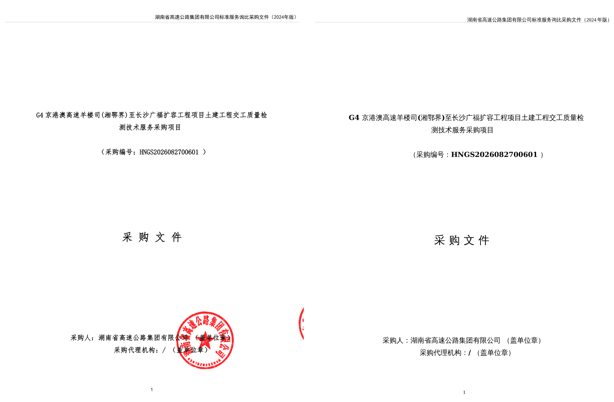
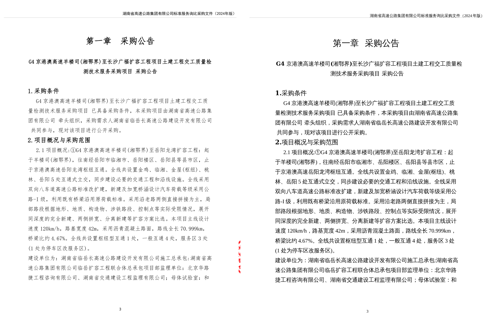

# pdf2word-textbox

> PDF 转 Word 工具 —— 基于文本框(Text Box)一比一精准复刻

[](https://www.python.org/)
[](LICENSE)

**pdf2word-textbox** 是一款专注于"位置 1:1 还原"的 PDF 转 Word(docx)工具。
与传统的流式排版转换(如 pdf2docx 默认模式)不同,本工具使用**绝对定位的文本框**
逐元素重建 PDF 页面,精准复刻:

- 字体、字号、颜色、粗体 / 斜体 / 下划线
- 段落、行距、对齐
- 页眉、页脚(含分割横线、对齐方式、矢量分割线)
- 页码
- 矢量图形(直线、矩形、填充)
- 图片
- 表格(按单元格文本框复刻,位置精确)
- 数学公式(按文本框复刻,保留原位置)

转换后 **docx 页数与 pdf 一模一样**,每个文本框的位置、大小、字体、颜色均与
原 PDF 一一对应。

## 效果对比

> 左:原始 PDF · 右:转换后 DOCX→PDF(文本框一比一复刻)

**第 1 页对比**:



**第 3 页对比**:



---

## 目录

- [设计理念](#设计理念)
- [核心特性](#核心特性)
- [安装](#安装)
- [快速开始](#快速开始)
- [命令行用法](#命令行用法)
- [Python API 用法](#python-api-用法)
- [工作原理](#工作原理)
- [页眉页脚处理](#页眉页脚处理)
- [与其它工具对比](#与其它工具对比)
- [限制与已知问题](#限制与已知问题)
- [项目结构](#项目结构)
- [更新日志](#更新日志)
- [许可证](#许可证)

---

## 设计理念

PDF 本质上是"固定版面"的文档,每个字符、每条线都有精确坐标;而 docx 默认是
"流式"文档,内容随段落自然流动。直接把 PDF 转成流式 docx 不可避免地会丢失
位置信息,导致:

- 页眉页脚错位
- 矢量图形丢失
- 页数对不上
- 表格变形
- 字体回退

**pdf2word-textbox** 的做法是:不试图"理解"文档结构,而是**忠实记录每个元素
的精确位置**,用 docx 的文本框(text box)和形状(shape)在页面上**一比一**
重建。这样:

| 需求                | 是否满足 |
|---------------------|----------|
| 字体 / 字号 / 颜色   | ✅       |
| 粗体 / 斜体 / 下划线 | ✅       |
| 页眉页脚 + 横线      | ✅       |
| 页码                 | ✅       |
| 矢量图形 / 分割线    | ✅       |
| 表格                 | ✅       |
| 数学公式             | ✅       |
| 页数一致             | ✅       |
| 位置 1:1 对应        | ✅       |

---

## 核心特性

- 🎯 **文本框一比一复刻**:每个文本片段用绝对定位文本框还原,坐标精确到 pt
- 📄 **页数精确匹配**:docx 页数 = pdf 页数(一页一 section)
- 📐 **页面尺寸精确**:docx 页面尺寸 = pdf 页面尺寸(支持任意纸张)
- 🏷️ **真实页眉页脚**:内容写入 docx header/footer(可编辑),含分割横线
- 🔢 **页码保留**:自动识别并保留页码文本
- ✏️ **字体样式完整**:字体名 / 字号 / 颜色 / 粗体 / 斜体 / 下划线 / 删除线
- 🖋️ **矢量图形**:直线、矩形、填充,精确复刻分割线、边框、底纹
- 🖼️ **图片**:绝对定位嵌入
- 🈯 **中日韩支持**:正确识别 CJK 字体并设置 eastAsia 字体
- ⚡ **极速**:97 页文档 1 秒完成转换
- 📦 **零重型依赖**:仅依赖 PyMuPDF + python-docx,无需 GPU / 模型

---

## 安装

```bash
pip install pdf2word-textbox
```

或从源码安装:

```bash
git clone https://github.com/koshoutou/pdf2word-textbox.git
cd pdf2word-textbox
pip install .
```

**依赖**:

- Python ≥ 3.9
- PyMuPDF ≥ 1.23.16
- python-docx ≥ 1.0.0
- lxml ≥ 4.9

---

## 快速开始

```bash
# 基本转换
pdf2word-textbox input.pdf output.docx

# 只转前 5 页
pdf2word-textbox input.pdf output.docx --start 0 --end 5
```

```python
from pdf2word_textbox import Converter

cv = Converter("input.pdf")
cv.convert("output.docx")
```

---

## 命令行用法

```
usage: pdf2word-textbox [-h] [--password PASSWORD] [--start START] [--end END]
                        [--header-ratio HEADER_RATIO] [--footer-ratio FOOTER_RATIO]
                        [--no-real-header-footer] [--no-detect-underline]
                        pdf docx

PDF 转 Word 工具 - 基于文本框一比一精准复刻

positional arguments:
  pdf                   输入 PDF 文件路径
  docx                  输出 DOCX 文件路径

optional arguments:
  --password            PDF 密码(若有)
  --start               起始页(0-based,默认 0)
  --end                 结束页(不含),默认到末尾
  --header-ratio        页眉区域占页面高度比例(默认 0.12)
  --footer-ratio        页脚区域占页面高度比例(默认 0.12)
  --no-real-header-footer
                        不使用 docx 真实页眉页脚(全部放正文文本框)
  --no-detect-underline
                        关闭下划线自动检测
```

---

## Python API 用法

```python
from pdf2word_textbox import Converter

cv = Converter("input.pdf", password="")

cv.convert(
    "output.docx",
    start=0,                    # 起始页
    end=None,                   # 结束页(None=末尾)
    header_ratio=0.12,          # 页眉区域比例
    footer_ratio=0.12,          # 页脚区域比例
    use_real_header_footer=True,# 用真实 docx 页眉页脚
    detect_underline=True,      # 自动检测下划线
)
```

---

## 工作原理

```
┌─────────────┐     ┌──────────────┐     ┌──────────────┐     ┌──────────┐
│   PDF 文件   │ ──▶ │  PyMuPDF 提取 │ ──▶ │ 页眉页脚检测  │ ──▶ │ DOCX 生成 │
└─────────────┘     └──────────────┘     └──────────────┘     └──────────┘
                     · 文本 span         · 重复文本统计        · 文本框(VML)
                     · 矢量图形          · 横线检测            · 形状(矩形/线)
                     · 图片              · 页码识别            · 真实 header/footer
                     · 字体/颜色/坐标    · 区域划分            · 一页一 section
```

### 1. 元素提取(`extractor.py`)

使用 PyMuPDF 的 `get_text("dict")` 提取文本 span(保留字体、字号、颜色、坐标),
`get_drawings()` 提取矢量图形,`get_image_info()` 提取图片。所有坐标以 pt 为单位,
原点在页面左上角。

### 2. 页眉页脚检测(`header_footer.py`)

- 统计每页顶部 / 底部区域的重复文本(跨页出现 → 页眉 / 页脚)
- 检测顶部 / 底部区域的水平横线 → 页眉 / 页脚分割线
- 识别页码文本(纯数字、罗马数字、"第 X 页"、"X/Y" 等)
- 计算每页 header_top / footer_top 边界

### 3. DOCX 生成(`docx_builder.py` + `converter.py`)

**关键技术:VML 文本框 + 页相对定位**

为什么用 VML 而非 DrawingML?因为 LibreOffice 对 DrawingML 的 `wps:wsp` 文本框
渲染支持不完整,而 VML(`v:shape type="#_x0000_t202"`)在 Word / LibreOffice /
WPS 中均能正确渲染,兼容性最佳。

每个文本框通过 VML style 的 `mso-position-horizontal-relative:page` /
`mso-position-vertical-relative:page` 实现**页相对绝对定位**:

```xml
<w:r><w:pict>
  <v:shape type="#_x0000_t202"
    style="position:absolute;
           left:91.85pt;top:79.96pt;
           width:470pt;height:14pt;
           mso-position-horizontal-relative:page;
           mso-position-vertical-relative:page;">
    <v:textbox>
      <w:txbxContent>
        <w:p><w:r>
          <w:rPr><w:rFonts w:ascii="Times New Roman" w:eastAsia="仿宋"/>
                <w:sz w:val="28"/><w:b/></w:rPr>
          <w:t>文本内容</w:t>
        </w:r></w:p>
      </w:txbxContent>
    </v:textbox>
  </v:shape>
</w:pict></w:r>
```

### 4. 页面结构

每页对应一个 docx section:

- `page_width` / `page_height` = PDF 页面尺寸(精确)
- `top_margin` = 页眉高度,`bottom_margin` = 页脚高度
- header → 页眉文本框 + 页眉分割横线
- footer → 页脚文本框(含页码) + 页脚分割横线
- body → 一个空段落作"画布",所有正文文本框 / 图形 / 图片绝对定位其上

---

## 页眉页脚处理

本工具对页眉页脚做了专门处理,满足"正常复刻嵌入"要求:

1. **真实 docx 页眉页脚**:内容写入 `header` / `footer` 部件,可在 Word 中双击编辑
2. **分割横线复刻**:检测页眉 / 页脚区域的水平线,作为矢量矩形复刻到对应位置
3. **对齐保留**:页眉页脚文本框按原 PDF 坐标定位,左右对齐自动还原
4. **页码保留**:识别页码文本(数字 / 罗马数字 / "第 X 页"),按原位置放置
5. **下划线检测**:若文本下方有紧贴的横线,自动标记为下划线样式

可使用 `--no-real-header-footer` 选项把页眉页脚也放进正文(纯文本框复刻模式),
适合需要完全位置锁定的场景。

---

## 与其它工具对比

| 特性                  | pdf2docx | Docling | PaddleOCR PP-Structure | LibreOffice | **pdf2word-textbox** |
|-----------------------|:--------:|:-------:|:----------------------:|:-----------:|:--------------------:|
| 流式排版(可编辑)      | ✅       | ✅      | ✅                     | ✅          | ❌(文本框)           |
| 位置 1:1 复刻         | ❌       | ❌      | ❌                     | ❌          | ✅                   |
| 页数精确匹配          | ❌       | ❌      | ❌                     | ❌          | ✅                   |
| 页眉页脚 + 横线        | 部分     | ❌      | ❌                     | ❌          | ✅                   |
| 矢量图形保留          | 部分     | ❌      | ❌                     | ❌          | ✅                   |
| 真实页眉页脚部件       | ❌       | ❌      | ❌                     | ❌          | ✅                   |
| 重型 ML 依赖          | ❌       | ✅      | ✅                     | ❌          | ❌                   |
| 速度(97 页)          | ~3s      | 慢      | 慢                     | ~10s        | **~1s**              |

> 注:流式排版工具(pdf2docx/Docling 等)的优势是**可编辑性**,适合需要二次
> 编辑的场景;本工具的优势是**位置保真**,适合需要"看起来和 PDF 一模一样"的
> 场景(如合同、标书、公文归档)。两者互补。

---

## 限制与已知问题

1. **字体替换**:若目标系统未安装原 PDF 使用的字体(如仿宋、黑体),Word 会
   使用替代字体,可能导致文本宽度变化。本工具通过文本宽度估算 + 禁止折行缓解,
   建议在安装了原字体的系统上使用。
2. **可编辑性**:由于使用文本框定位,生成的 docx 不适合大段文字编辑(移动一个
   文本框不会影响其他文本框)。如需可编辑文档,请用 pdf2docx。
3. **复杂表格**:表格按单元格文本框复刻(位置精确),但不还原为 docx 原生表格
   结构。如需可编辑表格,可用 pdf2docx。
4. **数学公式**:公式按文本框复刻(保留原位置和字体),但不转为 OMML 公式对象。
5. **斜线 / 曲线**:目前斜线用 VML `v:line` 渲染,曲线按包围盒矩形近似。

---

## 项目结构

```
pdf2word-textbox/
├── pdf2word_textbox/
│   ├── __init__.py          # 包入口,导出 Converter
│   ├── __main__.py          # python -m 入口
│   ├── converter.py         # 主转换器(编排所有模块)
│   ├── extractor.py         # PDF 元素提取(PyMuPDF)
│   ├── docx_builder.py      # DOCX 文本框/形状构建(VML)
│   ├── header_footer.py     # 页眉页脚检测
│   ├── fonts.py             # 字体映射与 CJK 处理
│   ├── colors.py            # 颜色工具
│   └── cli.py               # 命令行入口
├── examples/                # 示例
├── tests/                   # 测试
├── docs/                    # 文档
├── pyproject.toml
├── README.md
└── LICENSE
```

---

## 更新日志

### v1.1.0 (2025-10)

- 🔗 **超链接保留**:提取 PDF 中的 URI 超链接,匹配到对应文本 span,在 docx 中生成可点击超链接关系
- 📋 **元数据保留**:PDF 的 title / author / subject / keywords / producer 复制到 docx core properties
- 内部跳转链接(#pageN)识别与标记

### v1.0.0 (2025-10)

- ✨ 首个版本:基于 VML 文本框的 1:1 位置复刻
- 📄 页数精确匹配(一页一 section)
- 🏷️ 真实 docx 页眉页脚 + 分割横线复刻
- 🔢 页码自动识别与保留
- ✏️ 字体 / 字号 / 颜色 / 粗斜体 / 下划线完整复刻
- 🖋️ 矢量图形(直线 / 矩形 / 填充)复刻
- 🖼️ 图片绝对定位嵌入
- 🈯 CJK 字体正确设置 eastAsia
- ⚡ 97 页 1 秒转换

---

## 许可证

[GNU Affero General Public License v3.0 or later](LICENSE)(AGPL-3.0-or-later)。

本工具基于 PyMuPDF(AGPL-3.0)与 python-docx(MIT)。按照 AGPL 条款,任何使用
本工具提供网络服务的一方,均需向用户提供完整源代码。

---

## 致谢

- [PyMuPDF](https://pymupdf.readthedocs.io/) — PDF 解析
- [python-docx](https://python-docx.org/) — DOCX 生成
- [pdf2docx](https://github.com/ArtifexSoftware/pdf2docx) — 布局分析参考
- [Docling](https://github.com/DS4SD/docling) — 文档理解思路参考
- [PaddleOCR](https://github.com/PaddlePaddle/PaddleOCR) — OCR 套件参考
